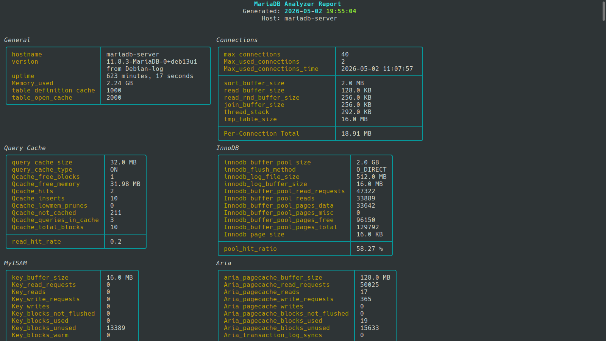
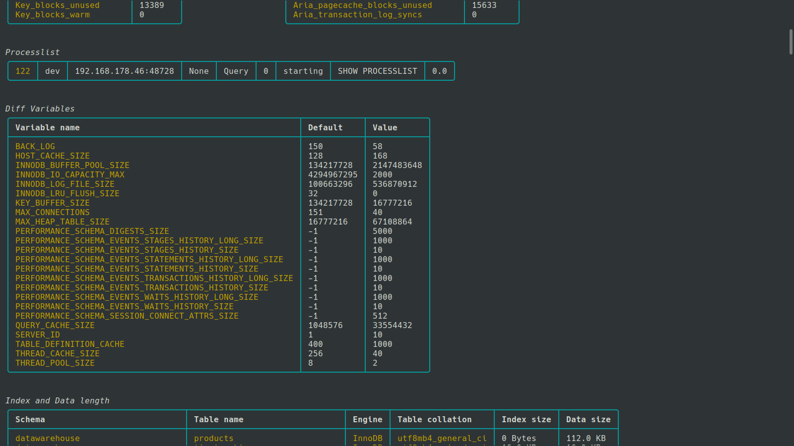

# MariaDB Analyzer

A compact command-line analysis and reporting tool for MariaDB servers.

MariaDB Analyzer connects to a running MariaDB instance, collects configuration variables, status metrics, and metadata, and presents the information as a structured terminal dashboard.

In addition to terminal output, the tool can also generate an HTML report that captures the current state of the database server for documentation, troubleshooting, or later review.

## Features

  * General server information (hostname, version, uptime, memory usage)
  * Connection and buffer settings
  * Storage engine statistics for:
      * InnoDB
      * MyISAM
      * Aria
  * Query cache statistics
  * Current process list
  * Differences between default and active server variables
  * Table data size and index size per schema
  * Export of the complete report as HTML

## Use Case

MariaDB Analyzer is designed for quick operational inspection of a running MariaDB server.

It helps answer questions such as:

  * How is the server currently configured?
  * What is the current operational state?
  * Which configuration values differ from defaults?
  * How much data and index space is being used?

## Installation

Please use Python Virtual Environment (venv) to install:

```bash
python3 -m venv .venv
source .venv/bin/activate
git clone https://github.com/peterpakula/mariadb-analyzer.git
cd mariadb-analyzer
pip3 install -r requirements.txt
```

## Usage

Create a .env file in the same directory as the script.

```bash
MARIADB_ANALYZER_USERNAME=root
MARIADB_ANALYZER_PASSWORD=your_password
MARIADB_ANALYZER_HOST=localhost
MARIADB_ANALYZER_PORT=3306
MARIADB_ANALYZER_DATABASE_NAME=information_schema

MARIADB_ANALYZER_VIEW_PROCESSLIST=1
MARIADB_ANALYZER_VIEW_DIFF_VARIABLES=1
MARIADB_ANALYZER_VIEW_INDEX_DATA_LENGTH=1
```

Run the script:

```bash
python mariadb-analyzer.py
```

## Requirements

The database user should have sufficient privileges to execute commands like:

  * SHOW VARIABLES
  * SHOW GLOBAL STATUS
  * SHOW PROCESSLIST

and to read from the information_schema.

## Output

The program produces two types of output.

### Terminal Dashboard

A formatted live overview of the MariaDB instance.

Example:





### HTML Report

A timestamped HTML snapshot is written to the current working directory.

Example filename:

```bash
20260502153045_report.html
```

This report contains the same information as the terminal dashboard and can be archived, shared, or attached to operational documentation.
